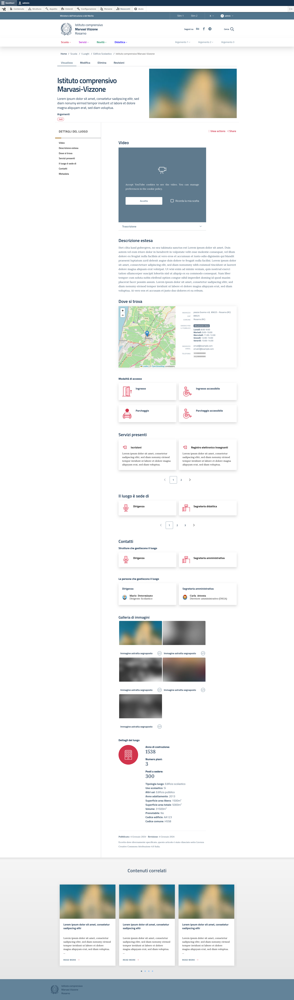

## Implementazione tipo Luogo
| Architettura                      | Implementazione                                           | Note                                             |
|-----------------------------------|-----------------------------------------------------------|--------------------------------------------------|
| Nome del luogo                    | title                                                     |                                                  |
| Descrizione breve                 | field_abstract                                            |                                                  |
| Argomenti                         | field_argomenti                                           | Vocabolario `argomenti` (Le parole della scuola) |
| Tipologia luogo                   | field_tipologia_luogo                                     | Vocabolario `tipologia_luoghi`                   |
| Immagine in evidenza              | field_copertina                                           | Riferimento Media `image`                        |
| Video                             | field_video                                               | Riferimento Media `video`                        |
| Galleria immagini                 | field_galleria_immagini                                   | Riferimento Media `image`                        |
| Descrizione estesa                | body                                                      |                                                  |
| Elementi di interesse nel luogo   | field_elementi_di_interesse                               | Riferimento Paragraphs `drupal/bootstrap_italia` |
| Parte di                          | field_luoghi                                              | Riferimento tipo di contenuto `Luogo`            |
| Indirizzo                         | field_indirizzo                                           | Modulo `drupal/address`                          |
| - CAP                             |                                                           | Incluso in field_indirizzo                       |
| Posizione GPS                     | field_coordinate_geografiche                              | Modulo `drupal/geofield`                         |
| Orario per il pubblico            | field_orario_pubblico                                     | Modulo `drupal/office_hours`                     |
| Email                             | field_email                                               |                                                  |
| Telefono                          | field_telefono                                            |                                                  |
| Modalità accesso                  | field_attributi_luogo                                     | Vocabolario `attributi_luogo`                    |
| Servizi presenti nel luogo        | **View relazione con CT `servizio`**                      |                                                  |
| Il luogo è sede di                | **View relazione con CT `struttura_organizzativa`**       |                                                  |
| Strutture che gestiscono il luogo | **View relazione con CT `struttura_organizzativa`**       |                                                  |
| Persone che gestiscono il luogo   | **View relazione con CT `struttura_organizzativa`**       |                                                  |
| Riferimento telefonico            | **View relazione con CT `struttura_organizzativa`**       |                                                  |
| Riferimento email                 | **View relazione con CT `struttura_organizzativa`**       |                                                  |
| Ulteriori informazioni            | field_extra_info                                          | Riferimento Paragraphs `drupal/bootstrap_italia` |
| Spazio prenotabile                | field_prenotabile                                         |                                                  |
| Anno di costruzione               | field_anno_costruzione                                    |                                                  |
| Numero Piani                      | field_numero_piani                                        |                                                  |
| Posti a sedere                    | field_posti                                               |                                                  |
| Metadati                          | **display**                                               |                                                  |
| Correlati: novità                 | **View relazione altri CT con `field_persone`, `author`** |                                                  |
| Codice edificio                   | field_codice_identificativo                               |                                                  |
| Codice comune                     | field_codice_catastale_comune                             |                                                  |
| Descrizione codice comune         |                                                           | **Non implementato**                             |
| Uso scolastico                    | field_uso_scolastico                                      |                                                  |
| Altri usi                         | field_destinazione_uso                                    | Vocabolario `destinazione_uso`                   |
| Anno adattamento                  | field_anno_adattamento                                    |                                                  |
| Superficie area totale            | field_superficie_area_totale                              |                                                  |
| Superficie area libera            | field_superficie_area_libera                              |                                                  |
| Volume                            | field_volume                                              |                                                  |

## Screenshot

