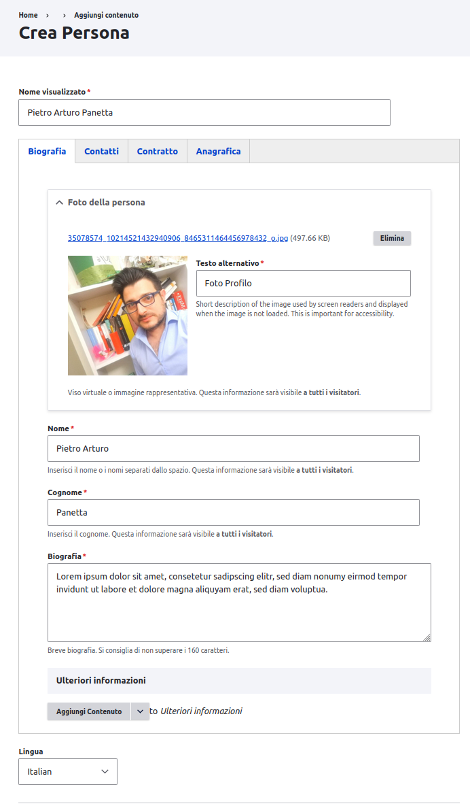
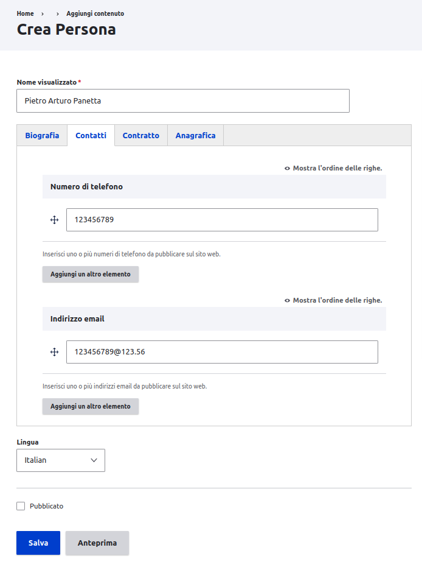
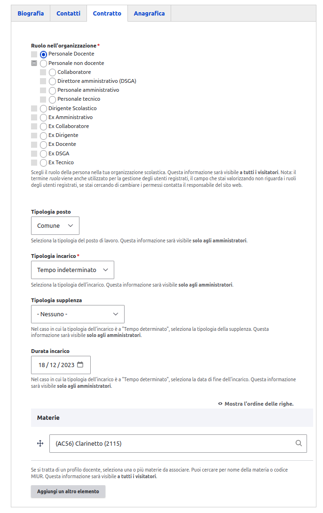
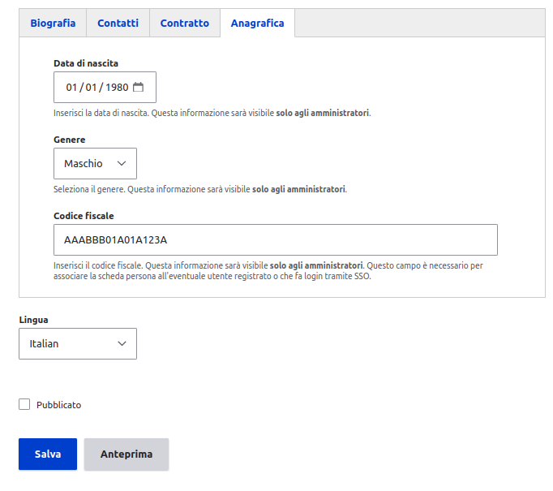
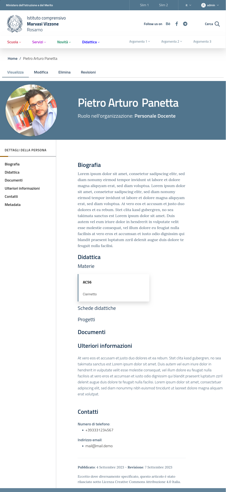

## Implementazione tipo Persona
| Architettura                               | Implementazione                                              | Note                                                                                                                                     |
|--------------------------------------------|--------------------------------------------------------------|------------------------------------------------------------------------------------------------------------------------------------------|
| Nome e cognome                             | field_nome,  field_cognome                               | L'informazione è stata divisa in due campi                                                                                               |
| Foto della persona                         | field_ritratto                                               |                                                                                                                                          |
| Ruolo nell'organizzazione                  | field_ruolo_persona                                          | Vocabolario `ruoli_persona`                                                                                                              |
| Ruolo (secondo livello)                    |                                                              | Non implementato  `field_ruolo_persona` è un campo multi-livello                                                                         |
| Biografia                                  | field_abstract                                               |                                                                                                                                          |
| Dove lavora                                | **View relazione con CT `struttura_organizzativa`**          |                                                                                                                                          |
| Strutture di cui la persona è responsabile | **View relazione altri CT con `field_persona_responsabile`** |                                                                                                                                          |
| Materie                                    | field_materie                                                | Vocabolario `materie`                                                                                                                    |
| Schede didattiche                          | **View relazione CT `scheda_didattica`**                     |                                                                                                                                          |
| Progetti                                   | **View relazione CT `progetto`**                             |                                                                                                                                          |
| Documenti                                  | **View relazione CT `documento`**                            |                                                                                                                                          |
| Ulteriori informazioni                     | field_extra_info                                             | Campo di tipo `Paragraphs`                                                                                                               |
| Numero telefono pubblico                   | field_telefono                                               |                                                                                                                                          |
| Indirizzo email pubblico                   | field_email                                                  |                                                                                                                                          |
| Metadati                                   | **display**                                                  |                                                                                                                                          |
| Correlati                                  | **View relazione altri CT con `field_persone`, `author`**    |                                                                                                                                          |
| Tipologia incarico                         | field_tipologia_incarico                                     | Vocabolario `tipologia_incarichi`                                                                                                        |
| Durata incarico                            | field_data_fine                                              |                                                                                                                                          |
| Tipo posto                                 | field_tipologia_posto                                        | Vocabolario `tipologia_posti`                                                                                                            |
| Tipo supplenza                             | field_tipologia_supplenza                                    | Vocabolario `tipologia_supplenze`                                                                                                        |
| Genere                                     | field_genere                                                 |                                                                                                                                          |
| Data di nascita                            | field_data_di_nascita                                        |                                                                                                                                          |
| Codice fiscale                             | field_codice_fiscale                                         | **Campo aggiunto rispetto all'architettura** Necessario per collegare l'eventuale utente registrato e/o che fa login da un servizio SSO. |

# Screenshot

